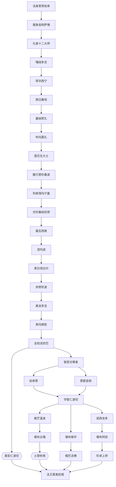

# 附：大圆满传承次第

```mermaid
graph TD
    A1[法身普贤如来] --> A2[报身金刚萨埵]
    A2 --> A3[化身十二大师]
    A3 --> B1[嘎绕多吉]
    B1 --> B2[蒋华西宁]
    B2 --> B3[西日桑哈]
    B3 --> C1[嘉纳思扎]
    C1 --> C2[布玛莫扎]
    C2 --> C3[莲花生大士]
    C3 --> D1[酿万登珍桑波]
    D1 --> D2[列单荡玛宁嘉]
    D2 --> D3[杰珍桑给旺修]
    D3 --> E1[嘉瓦扬敦]
    E1 --> E2[涅玛波]
    E2 --> E3[革日觉白尔]
    E3 --> F1[赤修钦波]
    F1 --> F2[美龙多吉]
    F2 --> F3[革玛燃匝]
    F3 --> G[全知龙钦巴]

    G --> H1{{麦彭仁波切}}
    G --> H2[智悲光尊者]

    H2 --> I1[如来芽]
    H2 --> I2[菩提金刚]

    I1 --> J[华智仁波切]
    I2 --> J

    J --> K1[格芒温波]
    J --> K2[堪布根华]
    J --> K3[诺西龙多]

    K1 --> L1[堪布云嘎]
    L1 --> M1{{土登秋佩}}

    K2 --> M2[俄巴活佛]

    K3 --> L3[堪布阿琼]
    L3 --> M3[珍卓上师]

    H1 --> N[法王晋美彭措]
    M1 --> N
    M2 --> N
    M3 --> N
```
